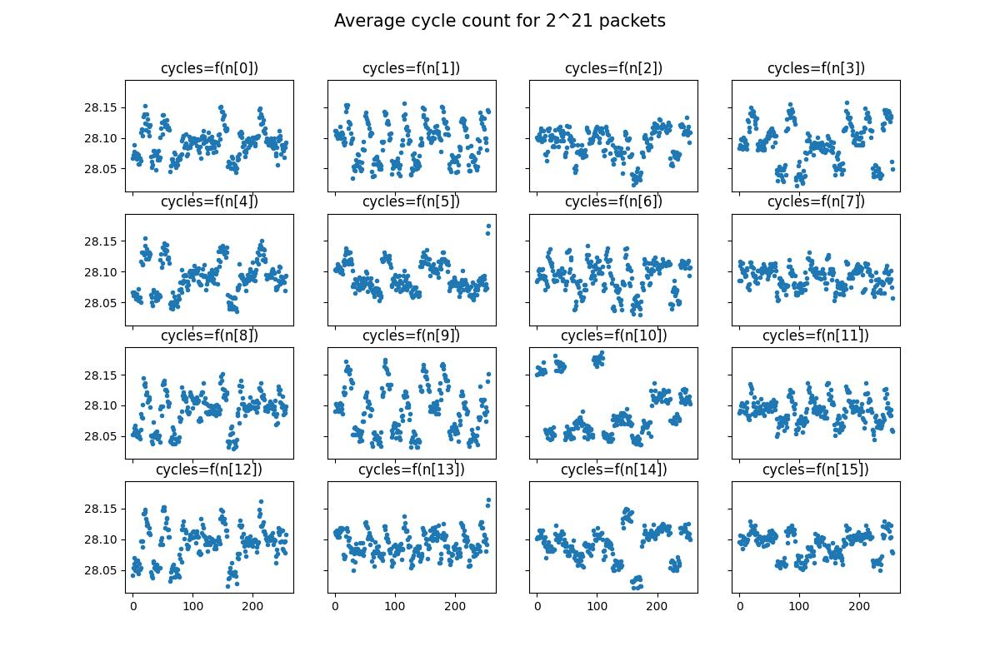
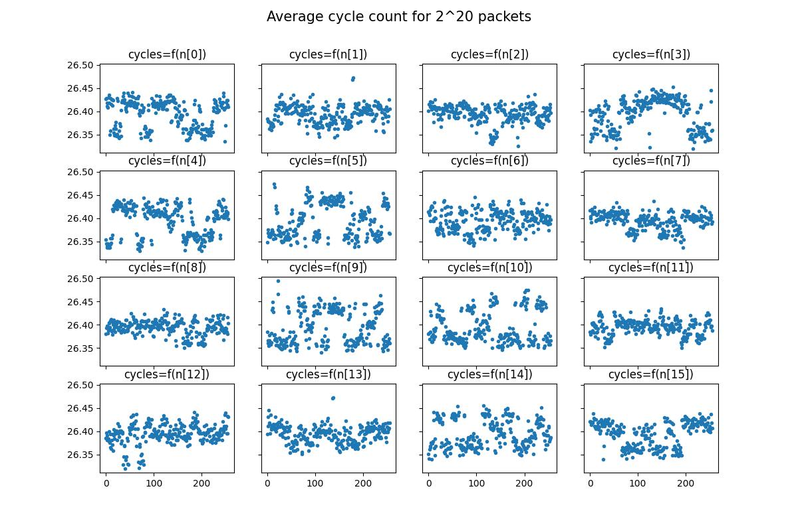

# Introduction
This repository is an implementation of the attack described in *Cache-timing attacks on AES* by Daniel J. Bernstein. Most of the code used here comes from his work in this paper.

The goal of the experiment is to see the results of the attack developed by the author, on an 'embedded' board. (In the paper, the attack is performed against an Intel Pentium III). Here, the target will be a Raspberry Pi 4 with an ARMv8 processor.

In this scenario, the victim (a **server**) is performing AES encryption on demand, with a private 128-bit key. The attacker (the **client**) sends the packets to encrypt and measure the time needed for the encryption, based on the server response that contains timestamps.

The exact procedure and the hardware used for the test are described below. The code can almost be directly compiled and used for any target board running Linux, except basically one line to change (more explanations below).

# Hardware

## Server
Raspberry Pi 4, Model B, 1Go RAM.

## Client
Personal laptop running Ubuntu 22 LTS.

The laptop and the Raspberry Pi 4 are linked by a ~1 m RJ45 cable. The IP addresses related to both ethernet ports are setup to put the laptop and the Raspberry Pi 4 on the same network.

A solution could be to simply connect both server and client on the same local area network, through wifi or ethernet.

# Software
The Raspberry Pi 4 is running **Raspberry Pi OS 64-bit lite** and the binary obtained with the compilation of the file *server.c*. Please note that if you want to compile the code of this repository, you have to install the **64-bit** version of the Raspberry Pi OS. Otherwise, the assembly line described in the next section (*Timestamp*) could cause the compilation to fail. You may need to change that line according to your hardware (and Linux type).

The laptop is mainly running the binary produced by the compilation of *study.c* for the attack.

# Timestamp
To perform the attack, we need to know how long the encryption lasts. Thus, we need to find a way to produce timestamps and to put it in the response packets that the server sends to the client. The more accurate the time base, the less noise we will have in our measurements and the easier it will be to find the key.

On an ARMv8 processor, one suitable solution is to get the value of the 64-bit register CNTVCT_EL0. This is done, in file *server.c*, with the following assembly line.

```
unsigned int timestamp(void)
{
    uint32_t cc;
    asm volatile("mrs %0, cntvct_el0"
                 : "=r"(cc));
    return cc;
}
```

**Warning:** this assembly line could cause the compilation to fail if you directly compile the source code on the Raspberry Pi and you use Raspberry Pi OS **32-bit** (and thus a 32-bit C toolchain), as it is available for some 64-bit ARM processors only.

Note: If your target is different, based on a x86 processor for instance, you have to change the previous code by:

```
unsigned int timestamp(void)
{
    unsigned int bottom;
    unsigned int top;
    asm volatile(".byte 15;.byte 49"
                 : "=a"(bottom), "=d"(top));
    return bottom;
}
```

# Procedure

## Step 1: Study phase

### Requirements
- You may need to run the following command before being able to compile the code:<br>
`sudo apt-get install libssl-dev`
- For some of analysis scripts, you may need python3 + numpy + matplotlib:<br>
`sudo apt install python3-venv python3-pip`<br>
`pip install numpy`<br>
`pip install matplotlib`<br>

Troubleshooting:
If you are in 'headless' mode for the Pi and you can't access the board through network, you can set the IP adress of the ethernet port statically in `/etc/dhcpcd.conf`:
```
# Example static IP configuration:
interface eth0
static ip_address=192.168.0.10/24
static ip6_address=fd51:42f8:caae:d92e::ff/64
static routers=192.168.0.1
static domain_name_servers=192.168.0.1 8.8.8.8 fd51:42f8:caae:d92e::1
```

- **Moreover, you need to know the IP address of your target and to assign to the environment variable TARGET_IP** (used by the *Makefile*).<br>
Example: If the IP address of the Raspberry PI is 192.168.0.32, just type:<br>
`export TARGET_IP=192.168.0.32`

In the rest of the procedure, a lot of actions are simplified by using makefiles, designed to be run directly on the Raspberry Pi 4 for the server-side, and on the laptop for the client-side.

### On the server side
`make build`<br>
`make server_zero_key`

### On the client side
`make build`<br>
`make study`

During the execution of the attack, it could be interesting to look at how each value for each byte in the input block affects the encryption time.

To do that, we can run<br>
`make overview_study`<br>

Example of curves, for the study phase, with a private key full of zeros:



It's really interesting to see that points or group of points are well isolated from the others.

The more samples you get, the less noise you'll get in timings measurement. Depending on the target, it could be enough to kill both processes on server and client side after the processing of 2^24 800-byte packets.

In a real attack scenario, this phase would executed **offline** on the same hardware as the victim.

## Step 2: Attack phase

### On the server side
`make new_private_key`<br>
`make server_private_key`

### On the client side
`make cyphertext`<br>
`make attack`

As for study phase, it could be interesting to look at the cycle count curves. To do that, we can run<br>
`make overview_attack`<br>

Example of curves, for the phase phase, with the private key to find:



We would kill both processes on server and client side after the processing of 2^24 800-byte packets, as the study phase.

## Step 3: Analysis

### Correlation
Now we have to compute the correlations of the two datasets.<br>
`make correlate`

It gives the correlation of the two collected datasets in the file *results/attack* (see the paper for more details).

The result gives all the remaining candidates for each byte of the private key. See below an example of the *attack* result file (executed before the end of the attack phase).

```
 61  0 17 16 f1 f0 f5 f9 f8 f4 f2 f3 f7 f6 b7 fe 96 97 e7 b6 [...]
 16  1 4c 4d ed ec 2d 2c 8d 8c 42 43 cd eb cc ea e2 4b
 18  2 25 24 26 27 2b 2a 29 23 28 22 20 21 2c 2e 2d 2f 64 65
 47  3 92 93 94 95 96 97 90 9d 9c 91 b2 b3 9b 9a 72 74 75 b4 [...]
 [...]
```

It means that they are 61 remaining candidates for the byte 0 of the key. The one that best matches (at this moment of the study) is 17. The candidates, from best to worst are represented from left to right. They are only 16 remaining candidates for key[1] and the best is 4c. Etc...

### Known bits
Let's suppose we have enough samples and we have eliminated enough candidates. We could now consider bits instead of bytes. One strategy to decide what is known could be:
```
For each byte of the key:
  For each bit in this byte:
    If all the remaining candidates have the same value for this bit:
    This bit is considered as known
  Else:
    This bit is considered as unknown
```
This can be done with a python script for instance. To get the result, please run:<br>
`make show_known_bits`<br>
One example of output, with 2^20 800-byte packets, is:
```
20 bits are supposed known with a probability >= 1.0
From left to right: k[0] ... k[15] 
________ ___0____ 0_10____ ___1____ ___0____ ___0____ ___1____ ___1____ ___0____ ___1____ 1_10101_ ___0____ ___0____ ___1____ ________ ________
```
We could have chosen a quite different strategy to decide if a bit is known. For the sake of simplicity, for each bit, let's call 'probability' the ratio of the most likely candidate among all. In the first strategy we only considered known bits with a probability of 1.0. But let's consider a minimum probability of 0.8 for instance. It would means that if more than 80% of the remaining candidates agree on the same value for a bit, we consider it as known.

With the same example data, if we run the custom command:<br>
`python3 tools/known_bits.py results/attack 0.8`<br>
We get the following output:
```
33 bits of the key are supposed known with a probability >= 0.8
From left to right: k[0] ... k[15] 
___1____ ___01___ 0010____ ___1____ ___0____ ___0____ ___1010_ ___1____ 1__0____ ___11___ 1_10101_ ___0____ ___0____ _1_1____ 1000____ ________ 
```

**Remark:** This value could be tuned with more experiences. We should not lower it too much to avoid 'false known bits', especially if we try a brute-force attack on the remaining unknown bits.

### Brute-force attack
If we are lucky and if we got enough samples to eliminate enough bits, we could try a brute-force attack. One efficient way to do that could be to start with best candidates, based on the order given by the output of *correlation* process, in *result/attack*.

### Useful scripts
Let's assume you launched a first study phase. Let's say it's not enough and you need to launch another study phase but you don't want to lose the time spent on the first one.
One solution could be to save the results of the first try:
```
tail -4096 results/study.800 > results/save_first_try.800
```
and then launch the second study:
```
make study
```
extract the relevant stats:
```
tail -4096 results/study.800 > results/save_second_try.800
```
you can merge the stats with the following python script:
```
python3 tools/merge_data.py results/save_first_try.800 results/save_second_try.800 results/merge_first_and_second.800
```
